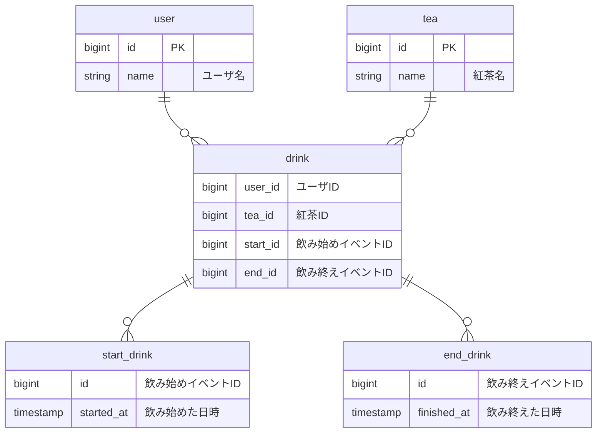
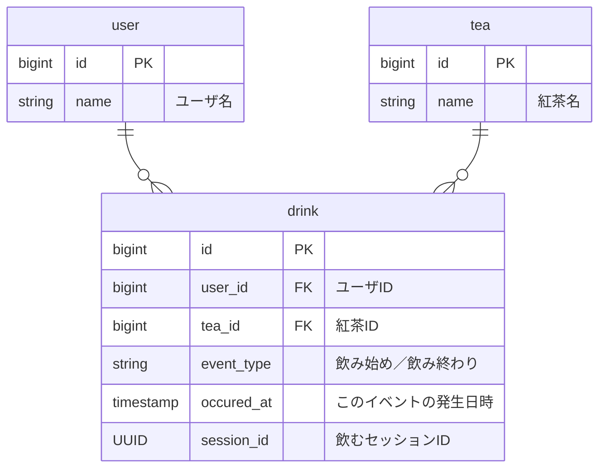

## 概要・背景
健康管理のため、どのくらいの頻度でどの紅茶を飲んでいるかを分析するためにデータを蓄積することにした。

## エンティティ
- ユーザ
- 紅茶
- 紅茶を飲み始める
- 紅茶を飲み終える

## ユースケース
- ユーザごとの飲み始めてから飲み終えるまでのペアの一覧を表示する

## ER図(1)

### コメント
- drinkが飲み始めの時点ではend_idがNULL許容になっているのがびみょい
- start_drinkとend_drinkは日付しか持っていないしどうせdrinkに更新が入るなら分ける意味なさそう

## ER図(2)

### コメント
- セッションIDで飲み始めと飲み終わりの対応関係がわかるようにした
- event_typeでイベントの種別を管理することで、update不要にした
- 全カラムNOT NULLで運用可能

## メモ
- 健康という観点なら紅茶だけというより飲み物全般管理の方が良さそう
  - という機能追加が今後行われそう
- その場合、砂糖が入っているかなど飲み物に対する追加の属性が必要になりそう
- もっとシステムが大きくなると食べ物も含む一日の食事管理みたいになりそう