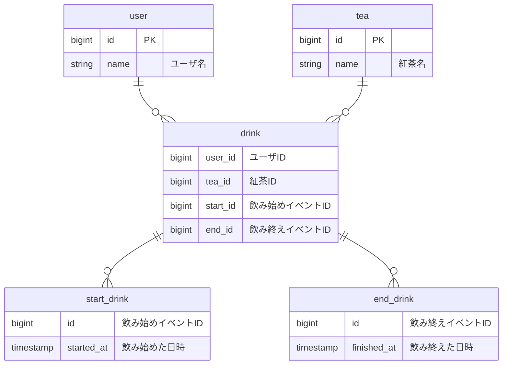

## 概要・背景
- レストランの受付システム
- 客は店頭の受付端末でチェックイン操作をする
  - 操作では人数を入力
- 空席がない場合、受付用のパスワードを何パターンかから選択する
  - 受付番号とパスワードが書かれた紙が印刷される
  - 番号が呼ばれたら、受付番号とパスワードを入力してチェックイン操作をし、空席がある場合と同様の流れで着席する
- 空席がある場合、席の番号が書かれた紙が印刷されるので、客は指定された席へ移動する
- 食事終了後、会計時に受付番号とともに清算する

## エンティティ
### リソース
- 客
- 席
- 席番号
- 受付番号
- パスワード

### イベント
- 席を確保する
- 受付番号を確保する
- 席を解放する
- 受付番号を解放する

## ER図(1)

## メモ
- 健康という観点なら紅茶だけというより飲み物全般管理の方が良さそう
  - という機能追加が今後行われそう
- その場合、砂糖が入っているかなど飲み物に対する追加の属性が必要になりそう
- もっとシステムが大きくなると食べ物も含む一日の食事管理みたいになりそう