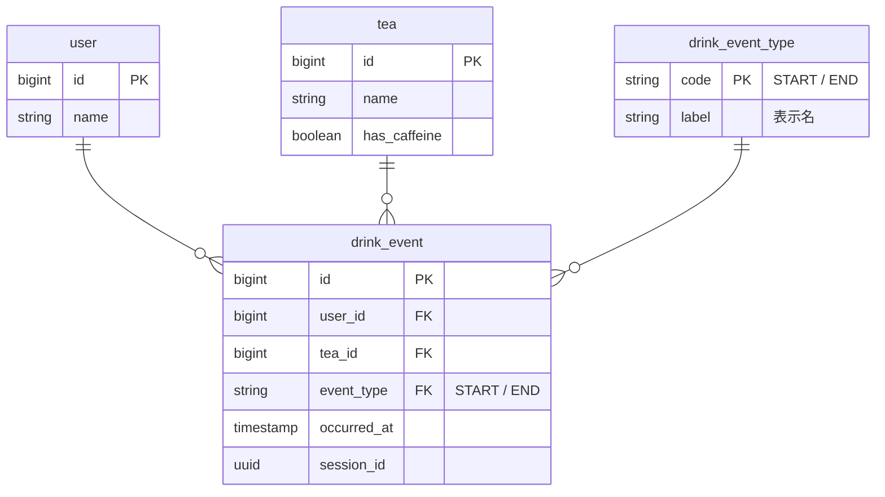

### 総評

`drink` テーブルをイベントログとして設計し、`session_id` で飲み始め・飲み終わりを対応付ける構造は、追記のみで運用できる点で実用的です。ただし、`event_type` の値域制御と `session_id + event_type` の一意性保証がモデル上に表現されておらず、データ整合性の担保が不十分です。また、ユースケースの「ペア一覧の表示」を実現するクエリ上の考慮が設計に反映されていません。

---

### 良い点

- **追記型イベントログ設計**: `drink` テーブルが状態ではなくイベントを記録する構造になっており、UPDATEを発生させずに履歴を保全できる
- **全カラムNOT NULL**: `session_id` を導入することで飲み終わりイベントを別レコードとして独立させ、NULL許容を排除できている
- **FK明示**: `user_id FK`・`tea_id FK` と明記されており、参照整合性への意識が設計に表れている

---

### 改善点・問題点

- 🔴高 **`event_type` の値域が無制約**: `string` 型では任意の文字列が入るため、`飲み始め` と `飲み始まり` のような表記ゆれを防げない。ENUMまたは参照テーブルで制約する必要がある
- 🔴高 **`session_id + event_type` の一意制約がない**: 同一セッションに `飲み始め` が2件INSERTされても検知できない。複合UNIQUE制約が必要
- 🟡中 **`drink` テーブルの `id PK` と `session_id` の役割が混在**: `id` はレコード識別、`session_id` はセッション識別と役割が異なる。`session_id` を主キーとするか、`id` との役割をコメントで明示すべき
- 🟡中 **ユースケースとのギャップ**: 「飲み始めから飲み終えるまでのペア一覧」を取得するには `session_id` でSELF JOINまたはピボットが必要だが、そのクエリが成立する設計かどうか（`END` がないセッションの扱いなど）が未検討
- 🟢低 **`occured_at` のスペルミス**: 正しくは `occurred_at`（`r` が1つ足りない）
- 🟢低 **`tea` テーブルの属性不足**: 健康管理が目的であれば、カフェイン含有量や茶葉の種類などの属性が将来必要になる（メモの拡張案と一致）

---

### SQLアンチパターン照合結果

| アンチパターン | 結果 |
|---|---|
| ジェイウォーキング | 該当なし |
| ナイーブツリー | 該当なし（階層構造なし） |
| IDリクワイアド | **要検討**: `drink` の `id PK` はレコード識別に使われているが、`session_id + event_type` の複合キーで代替できる可能性がある |
| キーレスエントリ | **軽微**: ER図上はFK明記されているが、`event_type` に対する参照整合性（値域制約）が未定義 |
| EAV | 該当なし |
| ポリモーフィック関連 | 該当なし |
| マルチカラムアトリビュート | 該当なし |
| メタデータトリブル | 該当なし |
| フロートで金額 | 該当なし（金額なし） |
| ファントムファイル | 該当なし |

---

### 具体的な改善提案

`event_type` を参照テーブルで制約し、一意性保証を追加した案です。



DDLで追加すべき制約：

```sql
-- session_id と event_type の組み合わせを一意に
ALTER TABLE drink_event
  ADD CONSTRAINT uq_session_event UNIQUE (session_id, event_type);

-- session_id単体でのペア取得クエリ例
SELECT
  s.occurred_at AS started_at,
  e.occurred_at AS ended_at,
  t.name AS tea_name
FROM drink_event s
JOIN drink_event e ON s.session_id = e.session_id AND e.event_type = 'END'
JOIN tea t ON s.tea_id = t.id
WHERE s.event_type = 'START'
  AND s.user_id = ?;
```

---

### 学習のポイント

**値域制約はモデルで表現する**  
`event_type` のような「とりうる値が決まっているカラム」は、ENUMや参照テーブルで制約をDB側に持たせることが重要です。アプリ側だけで制御すると、バグや直接INSERT時に不正値が混入します。

**一意性制約はビジネスルールの表現**  
「同じセッションで飲み始めは1回だけ」というルールは、アプリコードではなく `UNIQUE制約` として表現することでDBが自動的に保証します。制約はドキュメントでもあります。

**クエリから設計を検証する**  
ユースケース（ペア一覧の取得）を実際のSQLで書いてみると、設計の穴（飲み終わりがないセッションの扱い、パフォーマンスなど）が浮かび上がります。設計と同時にクエリを書く習慣をつけると設計精度が上がります。
